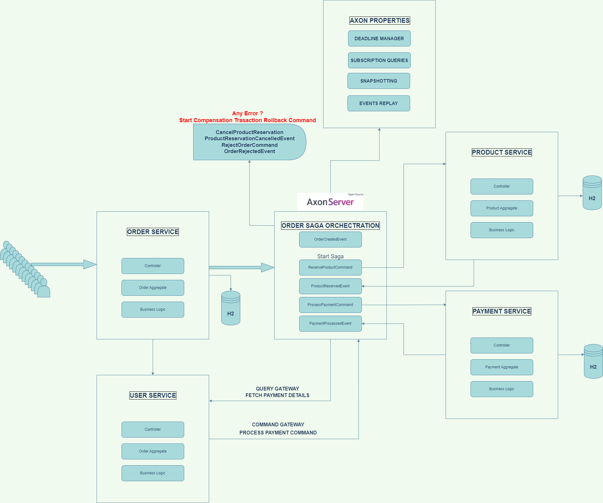

# Event-driven Microservices, CQRS, Event Sourcing, SAGA, Transactions Management by AXON SERVER

## Introduction

This is a sample project that shows how to implement a simple event-driven microservice architecture using .NET Core, CQRS, Event Sourcing, SAGA, Transactions, Sagas, CQRS and Event Sourcing.

## Architecture

<p align="center">

</p>

## Project Properties

- CORE - API ->

  - General axon configuration classes
  - General shared command and event classes for all microservices

- Order Service ->

  - Management all saga orchestration
  - Management if any error occurs in the saga orchestration compensating the transaction
  - Management all command and event classes for order service

- Product Service ->

  - Management of products command and query handlers

- Customer Service ->
  - Management of customers command and query handlers

## Technologies

- Java 17
- Spring Boot 2.7.5
- Spring Cloud 2021.0.3
- Axon Server 4.6.2
- Spring Cloud
- Spring Data JPA
- H2 Database
- Lombok
- Docker Compose
- Eureka Server

## Project Structure

- **core-api** - Contains the core api of the project
- **api-gateway** - Contains the api gateway of the project
- **registry-server** - Contains the eureka server of the project
- **order-service** - Contains the order service of the project and management the saga orchestration
- **payment-service** - Contains the payment service of the project
- **product-service** - Contains the product service of the project
- **user-service** - Contains the customer service of the project

## How to run

- First run axon server

```bash
cd infrastructure
docker-compose up -d
```

- Run the registry server

```bash
cd registry-server
mvn spring-boot:run
```

- Run the api gateway

```bash
cd api-gateway
mvn spring-boot:run
```

- Run the order service

```bash
cd order-service
mvn spring-boot:run
```

- Run the payment service

```bash
cd payment-service
mvn spring-boot:run
```

- Run the product service

```bash
cd product-service
mvn spring-boot:run
```

- Run the user service

```bash
cd user-service
mvn spring-boot:run
```
